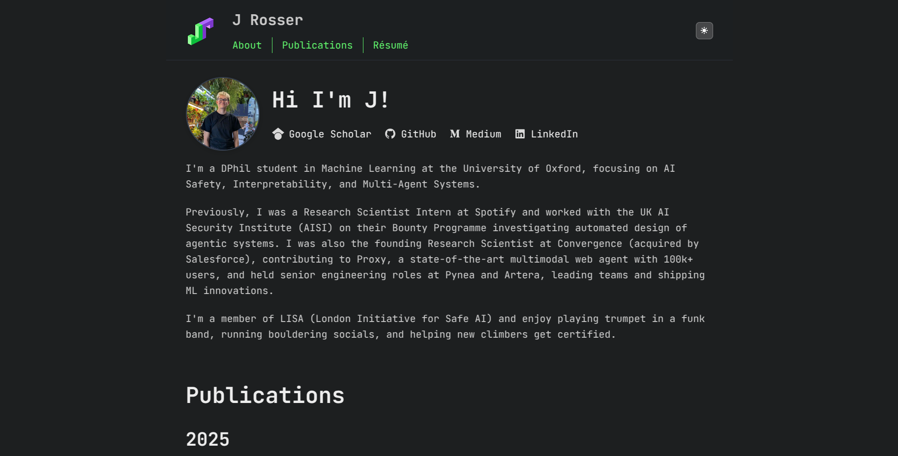

# Portfolio

My personal portfolio website showcasing research in Machine Learning and Astrochemistry.

**Live site:** [n-cipolla.github.io](https://n-cipolla.github.io)

## Preview

<!--  -->

## Tech Stack

- Vanilla HTML, CSS, JavaScript
- Markdown content
- GitHub Pages hosting

## Structure

- `docs/index.html` - Main page
- `docs/*.md` - Content (about, publications, resume)
- `docs/styles.css` - Styling
- `docs/script.js` - Functionality

Inspired by [astro-theme-cactus](https://astro-cactus.chriswilliams.dev/) and [https://jrosser.co.uk/](https://jrosser.co.uk/)