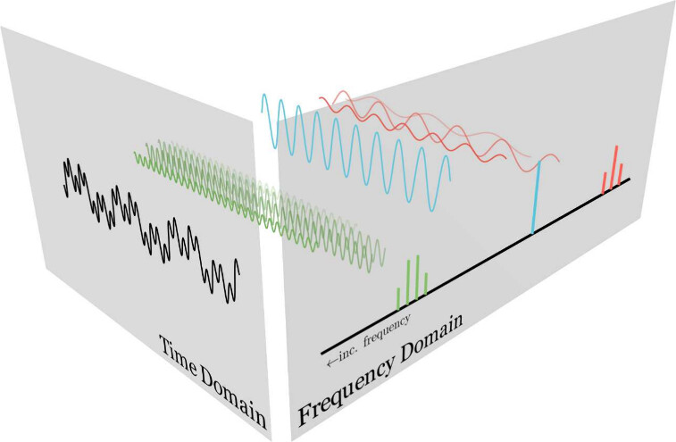
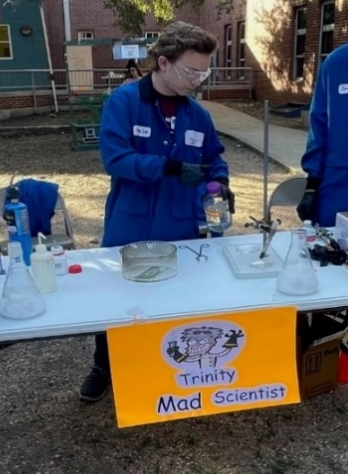

  
  

    <h1 class="title">Hi there! I'm Nick,</h1>
    

  <a href="https://scholar.google.com/citations?user=N3XWCoOhXbYC&hl=en" target="_blank" rel="noopener" style="display:inline-flex;align-items:center;gap:0.5rem;text-decoration:none;color:var(--color-accent-2);">
    <svg viewBox="0 0 24 24" role="img" aria-hidden="true" style="width:20px;height:20px;opacity:0.9;" xmlns="http://www.w3.org/2000/svg" fill="currentColor">
      <path d="M12 24a7 7 0 1 1 0-14 7 7 0 0 1 0 14zm0-24L0 9.5l4.838 3.94A8 8 0 0 1 12 9a8 8 0 0 1 7.162 4.44L24 9.5z"/>
    </svg>
    Google Scholar
  </a>
  <a href="https://github.com/n-cipolla" target="_blank" rel="noopener" style="display:inline-flex;align-items:center;gap:0.5rem;text-decoration:none;color:var(--color-accent-2);">
    <svg stroke="currentColor" fill="currentColor" stroke-width="0" viewBox="0 0 24 24" aria-hidden="true" style="width:20px;height:20px;opacity:0.9;" xmlns="http://www.w3.org/2000/svg"><path fill-rule="evenodd" clip-rule="evenodd" d="M12.026 2c-5.509 0-9.974 4.465-9.974 9.974 0 4.406 2.857 8.145 6.821 9.465.499.09.679-.217.679-.481 0-.237-.008-.865-.011-1.696-2.775.602-3.361-1.338-3.361-1.338-.452-1.152-1.107-1.459-1.107-1.459-.905-.619.069-.605.069-.605 1.002.07 1.527 1.028 1.527 1.028.89 1.524 2.336 1.084 2.902.829.091-.645.351-1.085.635-1.334-2.214-.251-4.542-1.107-4.542-4.93 0-1.087.389-1.979 1.024-2.675-.101-.253-.446-1.268.099-2.64 0 0 .837-.269 2.742 1.021a9.582 9.582 0 0 1 2.496-.336 9.554 9.554 0 0 1 2.496.336c1.906-1.291 2.742-1.021 2.742-1.021.545 1.372.203 2.387.099 2.64.64.696 1.024 1.587 1.024 2.675 0 3.833-2.33 4.675-4.552 4.922.355.308.675.916.675 1.846 0 1.334-.012 2.41-.012 2.737 0 .267.178.577.687.479C19.146 20.115 22 16.379 22 11.974 22 6.465 17.535 2 12.026 2z"></path></svg>
    GitHub
  </a>
  <a href="https://www.linkedin.com/in/nlcipolla/" target="_blank" rel="noopener" style="display:inline-flex;align-items:center;gap:0.5rem;text-decoration:none;color:var(--color-accent-2);">
    <svg stroke="currentColor" fill="currentColor" stroke-width="0" viewBox="0 0 24 24" aria-hidden="true" style="width:20px;height:20px;opacity:0.9;" xmlns="http://www.w3.org/2000/svg"><path d="M20 3H4a1 1 0 0 0-1 1v16a1 1 0 0 0 1 1h16a1 1 0 0 0 1-1V4a1 1 0 0 0-1-1zM8.339 18.337H5.667v-8.59h2.672v8.59zM7.003 8.574a1.548 1.548 0 1 1 0-3.096 1.548 1.548 0 0 1 0 3.096zm11.335 9.763h-2.669V14.16c0-.996-.018-2.277-1.388-2.277-1.39 0-1.601 1.086-1.601 2.207v4.248h-2.667v-8.59h2.56v1.174h.037c.355-.675 1.227-1.387 2.524-1.387 2.704 0 3.203 1.778 3.203 4.092v4.71z"></path></svg>
    LinkedIn
  </a>
  <a href="mailto:ncipolla@berkeley.edu" style="display:inline-flex;align-items:center;gap:0.5rem;text-decoration:none;color:var(--color-accent-2);">
    <svg xmlns="http://www.w3.org/2000/svg" width="16" height="16" fill="currentColor" class="bi bi-envelope" viewBox="0 0 16 16" style="width:20px;height:20px;opacity:0.9;"> <path d="M0 4a2 2 0 0 1 2-2h12a2 2 0 0 1 2 2v8a2 2 0 0 1-2 2H2a2 2 0 0 1-2-2zm2-1a1 1 0 0 0-1 1v.217l7 4.2 7-4.2V4a1 1 0 0 0-1-1zm13 2.383-4.708 2.825L15 11.105zm-.034 6.876-5.64-3.471L8 9.583l-1.326-.795-5.64 3.47A1 1 0 0 0 2 13h12a1 1 0 0 0 .966-.741M1 11.105l4.708-2.897L1 5.383z" stroke="currentColor" stroke-width="0.5"/></svg>
  Email
  </a>
  <a href="www.jbergner.com" style="display:inline-flex; align-items:center;gap:0.5rem;text-decoration:none;color:var(--color-accent-2);">
    <svg xmlns="http://www.w3.org/2000/svg" width="24" height="24" viewBox="0 0 24 24" fill="none" stroke="currentColor" stroke-width="2" stroke-linecap="round" stroke-linejoin="round" class="lucide lucide-orbit-icon lucide-orbit"><path d="M20.341 6.484A10 10 0 0 1 10.266 21.85"/><path d="M3.659 17.516A10 10 0 0 1 13.74 2.152"/><circle cx="12" cy="12" r="3"/><circle cx="19" cy="5" r="2"/><circle cx="5" cy="19" r="2"/></svg>
  Group Website
  </a>  
    

  

 

I'm a 1st year **Ph.D. student in Astrochemistry at the University of California, Berkeley**, working in the group of [Jennifer Bergner](jbergner.com/group.html) on applications of machine learning and artifical intelligence in the astrochemistry space (*pun intended*).

I am currently working on a project on using machine learning techniques to predict astrochemically relevant spectra of low-temperature, multi-component solids, which we believe to be relevant to planet formation.

I am passionate about advancing **Chemical Education** and **Science-Based outreach** and have published a *computational teaching lab* that walks students through aspects of the Fourier Transform in colaboration with professors at Trinity University, Chatham University, and the University of Colorado, Boulder. For more information, you can read our [Journal of Chemical Education paper](https://doi.org/10.1021/acs.jchemed.4c01439) or check out one of the interactive sections [here]().

 

  
   

  

Previously, I conducted polymer materials research with Professor Christina Cooley at Trinity University in San Antonio, Tx working on an analytical technique to mass and characterize polymers and polymer-based materials.

Outside of my chemistry research, I enjoy going thrifting, playing my French horn in a community orchestra, and exploring the Bay Area with friends! Also, in December, I attempt to solve the [Advent of Code](https://adventofcode.com/2025/about) challenges for each year.