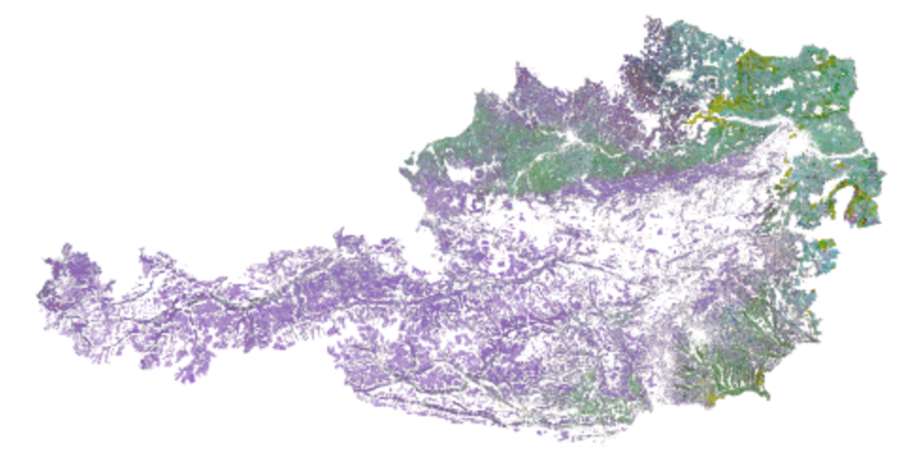
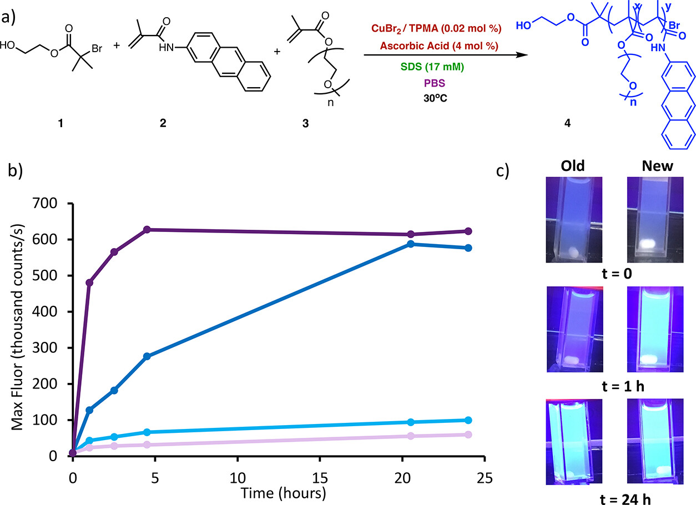
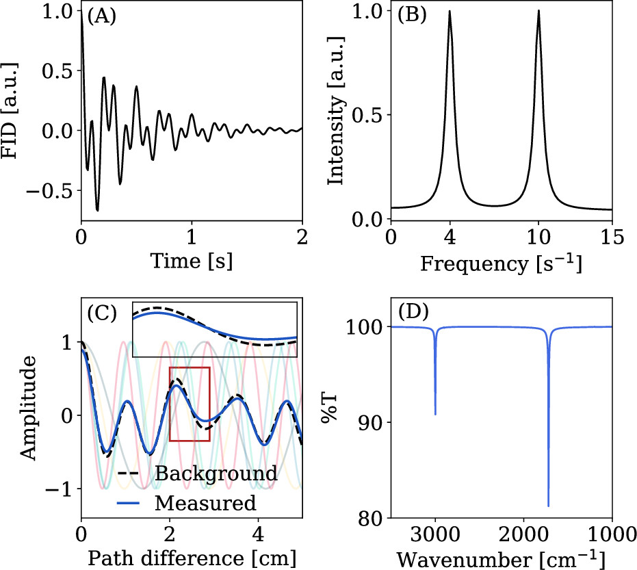

# Publications

## 2026

    

        
    

    

        <h3 class="publication-title">
            <a href="https://doi.org/10.1007/978-3-032-18974-5_23" class="publication-link">
                Applications of Deep learning for European Crop-Type Classification Through Satellite Image Data
            </a>
        </h3>
        
Book Chapter, 

        
<b>N.L. Cipolla</b>, E. Tuba, A. Alihodzic

        
April, 2026

        

            Deep Learning
        

    

## 2025

    

        
    

    

        <h3 class="publication-title">
            <a href="https://doi.org/10.1021/acsomega.5c09072" class="publication-link">
                Systematic Optimization of Fluorogenic ARGET ATRP Toward Rapid and Oxygen-Tolerant Analyte Detection
            </a>
        </h3>
        
Journal Article

        
J.B. McMurry, J.R. dos Remedios, <b>N.L. Cipolla</b>, M. Chamoun, C.B. Cooley

        
November 19, 2025

        

            Fluorogenic Polymerization
            <a href="https://pubs.acs.org/page/acsodf/vi/undergraduate-research-as-stimulus-for-scientific-progress-usa" class="tag tag-arxiv">Special Edition Feature</a>
        

    

    

        
    

    

        <h3 class="publication-title">
            <a href="https://doi.org/10.1021/acs.jchemed.4c01439" class="publication-link">
                A Pedagogical Tour of the Fourier Transform with Applications to NMR and IR Spectroscopy
            </a>
        </h3>
        
Journal Article

        
A.J. Dominic III‡, <b>N.L. Cipolla</b>‡, W.C. Pfalzgraff, J.A. Jankowski, R.J. Rapf, A. Montoya-Castillo

        
April 23, 2025

        

            Chemical Education
            <a href="https://arxiv.org/abs/2410.09619" class="tag tag-arxiv">arxiv</a> 
            <a href="https://github.com/Montoya-Castillo-Group/FourierTransforms" class="tag tag-github">Github</a>
        

    

